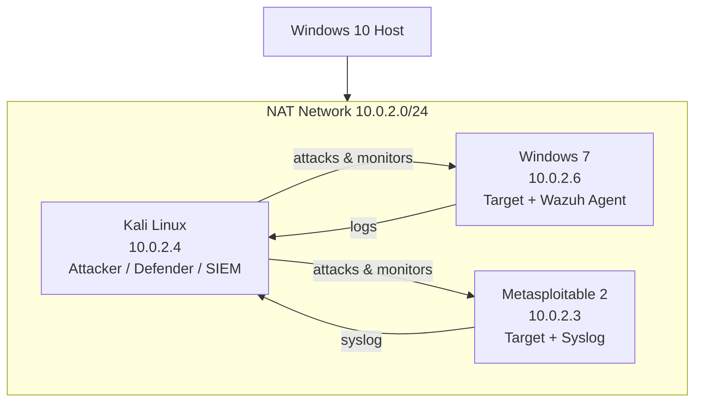

# Homelab overview

The host is running on Windows 10 with all VMs connected on a NAT network so they can communicate with each other but are isolated from my home network.

---

## Machines

- **Kali Linux** - Used for both offense and defense. Runs Nmap, Metasploit, Wireshark, Snort, and Wazuh Manager.
- **Windows 7** - Unpatched target for exploitation (EternalBlue). Runs Wazuh agent for monitoring.
- **Metasploitable 2** - Intentionally vulnerable Linux machine. Multiple exploitable services (Samba, vsftpd, Telnet). Forwards syslog to Wazuh.

---

## Network design

---

## Tools used

**Offensive:** Nmap, Metasploit, Meterpreter, searchsploit, OpenVAS, theHarvester, Sherlock

**Defensive:** Snort IDS, Wazuh SIEM, iptables/UFW, Wireshark, auditd

**Other:** VirtualBox, Python, Bash, Git

---

## Skills developed

- Penetration testing workflow: planning, scanning, exploitation, post-exploitation, reporting
- Network traffic analysis and packet inspection
- IDS rule writing and tuning
- SIEM deployment and log correlation
- Firewall configuration and network hardening
- Incident investigation using NIST IR framework
- Security automation with Python