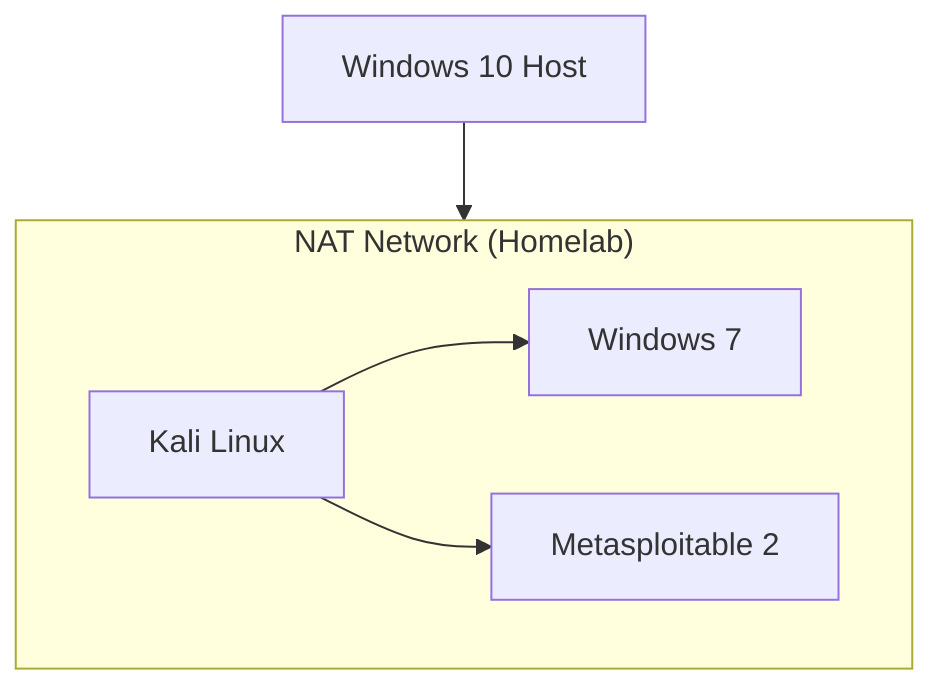

## Home Lab Overview

The Host is running on Windows 10 with virtual networks connected on NAT network so I can access other host.

### Common diagram types

- `Kali Linux` - (Use for Defense and Offense practice / attack simulation / security testing)
- `Windows 7` - (Use for attack simulations)
- `Metasploitable 2` (intentionally vulnerable system)

---
### Network Design

---
### Tools Used
- Kali Linux
- Basic OSINT tools
- Nmap
- Metasploit
- Wireshark
- Virtualization platforms (VirtualBox)

---

### Key Skills Developed

- Learned basic fundamentals Planning &rarr; Scanning &rarr; Exploitation &rarr; Post-Exploitation &rarr; Reporting
- Awareness of common system vulnerabilities
- Learned offensive perspective