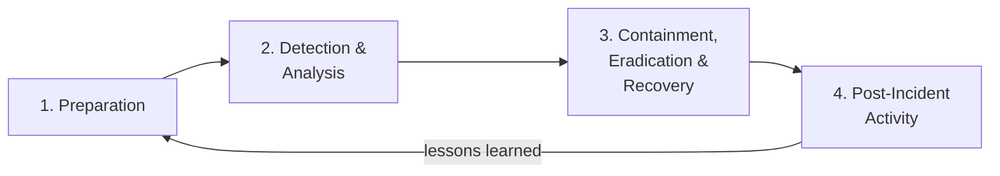

# Log analysis - incident investigation

This writeup walks through investigating a simulated attack using SIEM logs and the NIST Incident Response framework. I ran an attack against the homelab, then switched to the defender side and traced what happened through Wazuh and system logs.

The goal: follow the same process a SOC analyst would use when responding to an alert.

---

## The attack (red team side)

I simulated a realistic attack chain against the lab network:

1. **Reconnaissance** - Nmap SYN scan against `10.0.2.0/24`
2. **Exploitation** - EternalBlue (MS17-010) against Windows 7
3. **Post-exploitation** - Meterpreter session, ran `hashdump` and `sysinfo`
4. **Persistence** - Created a new user account on the compromised machine

This covers MITRE ATT&CK techniques: T1046 (Network Service Discovery), T1210 (Exploitation of Remote Services), T1003 (OS Credential Dumping), T1136 (Create Account).

I ran the attack, closed my terminal, and then investigated purely from the SIEM.

---

## NIST Incident Response framework

NIST SP 800-61 defines four phases for incident response:



I followed phases 2-4 since the preparation (setting up Wazuh, Snort, logging) was already done in earlier labs.

---

## Phase 2: Detection and analysis

### Initial alert

Wazuh dashboard showed a level 10 alert at 14:23:

```
Rule 5712 - SSH brute force attack
Source IP: 10.0.2.4
Target: 10.0.2.6
```

Wait - this was the Nmap scan. The SYN scan triggered multiple connection attempts that Wazuh flagged. Snort also generated alerts that Wazuh ingested:

```
Snort alert: Possible Nmap SYN scan detected (SID 1000001)
Snort alert: Possible EternalBlue exploit attempt (SID 1000002)
Snort alert: Possible reverse shell connection on port 4444 (SID 1000003)
```

### Timeline reconstruction

Pulled events from Wazuh sorted by timestamp:

| Time | Event | Source |
|---|---|---|
| 14:23:15 | SYN scan detected (200+ connection attempts in 3 seconds) | Snort |
| 14:23:17 | Multiple SMB connection attempts on port 445 | Snort |
| 14:25:02 | EternalBlue exploit traffic detected | Snort |
| 14:25:04 | Outbound connection to port 4444 (reverse shell) | Snort |
| 14:25:08 | New process spawned: `cmd.exe` as SYSTEM | Windows Event Log |
| 14:26:30 | Credential dump detected (LSASS access) | Wazuh rule |
| 14:28:15 | New user account created: `backdoor_user` | Windows Event Log |

### Analysis

The timeline tells a clear story: recon at 14:23, exploitation at 14:25, credential harvesting at 14:26, persistence at 14:28. Total time from first scan to persistence: about 5 minutes.

Key IOCs (Indicators of Compromise):
- **Source IP:** 10.0.2.4 (Kali)
- **Attack vector:** SMBv1 exploitation (port 445)
- **C2 channel:** TCP port 4444 (Meterpreter default)
- **Persistence:** New local user account created

---

## Phase 3: Containment, eradication, and recovery

### Containment

In a real scenario, the immediate steps would be:

```bash
# Block the attacker IP at the firewall
sudo iptables -A INPUT -s 10.0.2.4 -j DROP

# Isolate the compromised machine (in VirtualBox: disconnect network adapter)
# Or at the switch level: disable the port
```

### Eradication

Remove the attacker's foothold:

```bash
# Remove the backdoor account
net user backdoor_user /delete

# Check for other persistence mechanisms
# Scheduled tasks
schtasks /query
# Startup items
wmic startup list full
# Services
sc query state= all | find "backdoor"
```

### Recovery

```bash
# Apply the MS17-010 patch (this should have been done before)
# Disable SMBv1
Disable-WindowsOptionalFeature -Online -FeatureName smb1protocol

# Force password reset for all accounts (hashes were dumped)
# Restore from known-good snapshot if available
```

---

## Phase 4: Post-incident activity

### What worked

- Snort detected the scan and exploitation in real time
- Wazuh aggregated Snort alerts with Windows Event Logs for a complete timeline
- The attack was detectable at every stage

### What didn't work

- No automated response - I had to manually block the IP and isolate the machine. In a real SOC, Wazuh active response could have blocked the attacker after the first Snort alert.
- The 5-minute window between first scan and persistence is too long. Automated containment should trigger within seconds of confirmed exploitation.
- The reverse shell on port 4444 was detectable because it used the default Meterpreter port. A real attacker would use port 443 or 80 to blend in with normal traffic.

### Lessons for improvement

1. Configure Wazuh active response to auto-block IPs after high-severity Snort alerts
2. Set up email notifications for level 10+ alerts
3. Test with non-default Meterpreter ports to see if the Snort rules still catch it
4. Add network segmentation so a compromised machine can't reach the rest of the network (covered in my [firewall writeup](../04-defense/firewall-hardening.md))

---

## Takeaway

Running the attack and then investigating it myself was the most useful exercise in this entire lab series. The offensive side teaches you how attacks work. The defensive side teaches you how to find them. Doing both with the same attack makes the connection obvious.

The NIST framework turned out to be less academic than I expected. When I had an actual incident to investigate (even a simulated one), the four phases gave me a structure to follow instead of just poking around randomly in logs. Detection, containment, eradication, recovery - that sequence matters because doing them out of order (like trying to eradicate before containment) risks losing evidence or letting the attacker pivot.
