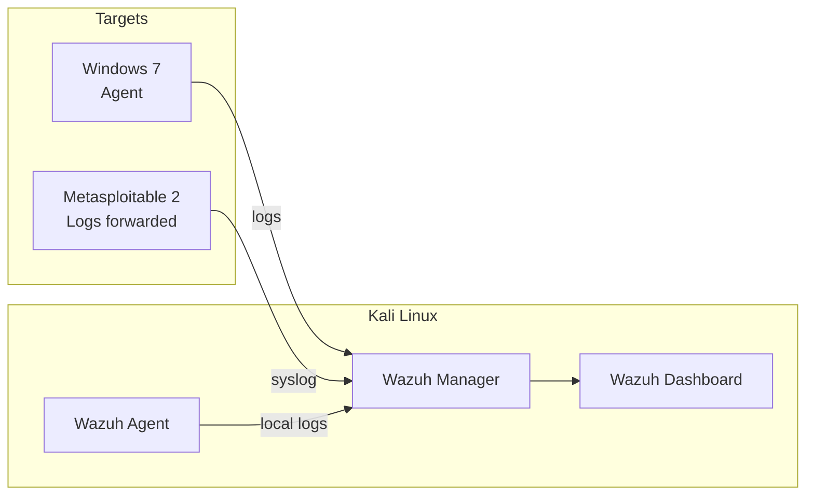

# Wazuh SIEM setup

After setting up Snort for real-time packet inspection and iptables for traffic filtering, I needed something to centralize all of it. Wazuh is an open-source SIEM (Security Information and Event Management) that aggregates logs from multiple sources, correlates events, and generates alerts from a single dashboard.

I chose Wazuh over Splunk because it's free with no data limits, runs well on homelab hardware, and covers the same SIEM concepts.

---

## What Wazuh does

Wazuh has three components:

1. **Wazuh Manager** - the server that receives and processes logs
2. **Wazuh Agents** - installed on monitored machines, collect and forward logs
3. **Wazuh Dashboard** - web interface for viewing alerts, logs, and reports (runs on OpenSearch)



---

## Installation

### Wazuh Manager and Dashboard (on Kali)

Used the all-in-one installation script:

```bash
curl -sO https://packages.wazuh.com/4.7/wazuh-install.sh
sudo bash wazuh-install.sh -a
```

This installs the manager, indexer (OpenSearch), and dashboard on the same machine. For a homelab this is fine. In production you'd split them across separate servers.

After installation, the dashboard is available at `https://localhost` with credentials printed during setup.

### Wazuh Agent (on target machines)

On machines that support it, install the agent:

```bash
# On a Linux target
curl -sO https://packages.wazuh.com/4.7/wazuh-install.sh
sudo WAZUH_MANAGER="10.0.2.4" apt install wazuh-agent
sudo systemctl enable wazuh-agent
sudo systemctl start wazuh-agent
```

For Metasploitable 2 (too old for the agent), I forwarded syslog instead:

```bash
# On Metasploitable, add to /etc/rsyslog.conf
*.* @10.0.2.4:514
```

Then configured the Wazuh manager to accept syslog on port 514.

---

## Configuration

### What Wazuh monitors by default

Once agents are connected, Wazuh automatically monitors:

- **Log analysis** - `/var/log/auth.log`, `/var/log/syslog`, Windows Event Logs
- **File integrity monitoring (FIM)** - alerts when critical files change (`/etc/passwd`, `/etc/shadow`, SSH configs)
- **Rootkit detection** - scans for known rootkits and suspicious system modifications
- **Vulnerability detection** - compares installed software against CVE databases

### Custom rules I added

Added rules to the manager config (`/var/ossec/etc/ossec.conf`) for homelab-specific monitoring:

```xml
<!-- Monitor iptables dropped packets -->
<localfile>
  <log_format>syslog</log_format>
  <location>/var/log/kern.log</location>
</localfile>

<!-- Monitor Snort alerts -->
<localfile>
  <log_format>snort-full</log_format>
  <location>/var/log/snort/alert</location>
</localfile>
```

This means Wazuh now ingests:
- System authentication logs (SSH logins, sudo commands, failed attempts)
- Firewall drop logs from iptables
- Snort IDS alerts

Everything from my other defensive labs feeds into one place.

---

## Dashboard overview

The Wazuh dashboard shows:

| Panel | What it shows |
|---|---|
| Security events | All alerts aggregated across agents, sortable by severity |
| Integrity monitoring | File changes on monitored systems |
| Vulnerability detection | Known CVEs affecting installed software |
| MITRE ATT&CK | Alerts mapped to MITRE techniques |
| Agent status | Which agents are connected and reporting |

The MITRE ATT&CK panel is useful because it maps detected activity to the same framework I reference in my offensive writeups. When I run an EternalBlue exploit, the dashboard shows it under T1210 (Exploitation of Remote Services) - the same technique I tagged in my [exploitation writeup](../02-exploitation/eternalblue-windows7/writeup.md).

---

## Alert rules

Wazuh uses rule IDs and severity levels (1-15) to categorize alerts. Some relevant built-in rules:

| Rule ID | Level | Description |
|---|---|---|
| 5710 | 5 | SSH login attempt with wrong password |
| 5712 | 10 | SSH brute force (multiple failures) |
| 5502 | 3 | User login |
| 5503 | 8 | User account changed |
| 550 | 7 | File integrity change detected |
| 510 | 7 | File added to monitored directory |

Level 10+ alerts are treated as high severity. An SSH brute force attempt (rule 5712) triggers at level 10, which I configured to send immediate notifications.

---

## Testing

Ran a simulated SSH brute force against a target with the Wazuh agent installed:

```bash
# From Kali, try multiple wrong passwords
hydra -l root -P /usr/share/wordlists/rockyou.txt ssh://10.0.2.3 -t 4
```

Within seconds, the Wazuh dashboard showed:

1. Multiple rule 5710 alerts (failed SSH login)
2. Rule 5712 alert (brute force detected)
3. Source IP flagged

The alerts appeared in real time on the dashboard. This is what I was doing manually with Wireshark and Snort, but now it's centralized with history and search.

---

## Takeaway

Wazuh ties together everything from the other defensive labs. Firewall logs, Snort alerts, authentication events, and file changes all flow into one dashboard. Instead of checking five different log files on three different machines, I check one interface.

The setup is more involved than the other tools (Snort and iptables are simpler), but the centralized visibility is worth it. In a real environment with dozens of machines, there's no way to monitor each one individually. SIEM is how you scale security monitoring.

The main thing I'd improve is adding automated response - Wazuh can trigger scripts when certain alerts fire (like blocking an IP after a brute force attempt). That's on my list for future lab work.
