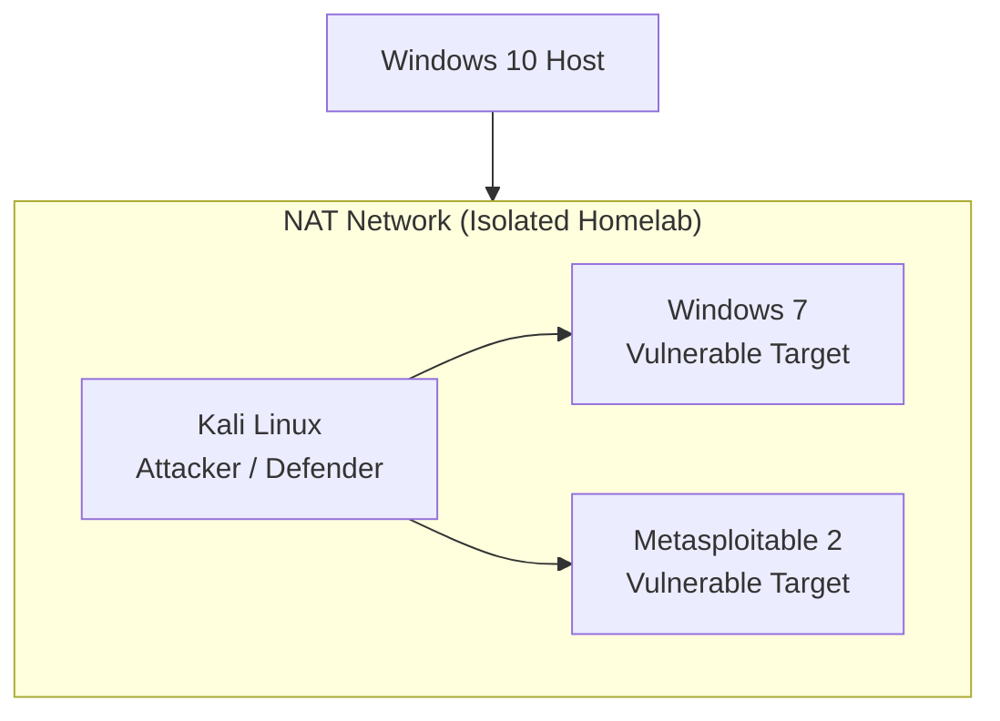

# Cybersecurity Homelab

Personal cybersecurity lab built on VirtualBox. I use this to practice both offensive and defensive security: scanning, exploitation, traffic analysis, SIEM monitoring, firewall configuration, and incident response. Everything runs on an isolated NAT network so nothing touches production.

All findings and processes are documented here.

**Certifications**

**Skills**

---

## Lab environment

Three VMs on a NAT network. Kali handles both offense (Metasploit, Nmap) and defense (Snort, Wireshark, Wazuh agent). Windows 7 and Metasploitable 2 are intentionally unpatched targets.

---

## Writeups

### Reconnaissance (Offensive)
| # | Writeup | Tools | What it covers |
|---|---------|-------|----------------|
| 1 | [Nmap scanning and enumeration](00-homelab-setup/overview.md) | Nmap, Metasploit auxiliary | Port scanning, service detection, version enumeration |
| 2 | [OSINT and passive recon](01-reconnaissance/OSINT-tools.md) | Whois, NSLookup, theHarvester, Sherlock | DNS mapping, email harvesting, username enumeration |
| 3 | [Vulnerability scanning with OpenVAS](01-reconnaissance/vulnerability-scanning.md) | OpenVAS | Automated scanning, CVSS scoring, comparing results to manual recon |

### Exploitation (Offensive)
| # | Writeup | Tools | What it covers |
|---|---------|-------|----------------|
| 4 | [EternalBlue - Windows 7](02-exploitation/eternalblue-windows7/writeup.md) | Metasploit, Meterpreter | MS17-010, SMBv1 exploitation, post-exploitation |
| 5 | [Metasploitable 2 - multiple services](02-exploitation/metasploitable-attacks/writeup.md) | Metasploit, searchsploit | Samba, vsftpd backdoor, Telnet |

### Network analysis (Defensive)
| # | Writeup | Tools | What it covers |
|---|---------|-------|----------------|
| 6 | [Wireshark traffic analysis](03-network-analysis/wireshark-traffic-analysis.md) | Wireshark | Packet capture during exploitation, identifying malicious traffic patterns |

### Defense and hardening
| # | Writeup | Tools | What it covers |
|---|---------|-------|----------------|
| 7 | [Firewall hardening with iptables](04-defense/firewall-hardening.md) | iptables, UFW | Rule creation, blocking exploit traffic, before/after testing |
| 8 | [Snort IDS - detecting attacks](04-defense/snort-ids-setup.md) | Snort | IDS setup, custom rules, alert analysis |
| 9 | [Linux access controls](04-defense/linux-access-controls.md) | Linux utilities | User management, file permissions, SSH hardening, audit logging |

### SIEM and incident response
| # | Writeup | Tools | What it covers |
|---|---------|-------|----------------|
| 10 | [Wazuh SIEM setup](05-siem-monitoring/wazuh-siem-setup.md) | Wazuh | SIEM deployment, agent configuration, dashboard, alert rules |
| 11 | [Log analysis - incident investigation](05-siem-monitoring/log-analysis-incident.md) | Wazuh, Linux logs | Simulated attack, detection, investigation, NIST IR framework |

### Automation
| # | Writeup | Tools | What it covers |
|---|---------|-------|----------------|
| 12 | [Python log parser](06-automation/python-log-parser.md) | Python | Parsing auth logs, flagging brute force attempts, generating reports |

### Lessons learned
| # | Writeup |
|---|---------|
| 13 | [What I learned the hard way](07-lessons-learned/what-i-understood.md) |

---

## Tools used

**Offensive:** Nmap, Metasploit, Meterpreter, searchsploit, theHarvester, Sherlock, OpenVAS

**Defensive:** Snort IDS, Wazuh SIEM, iptables/UFW, Wireshark

**Other:** VirtualBox, Kali Linux, Python, Bash, Git

---

## Disclaimer

All testing was performed in an isolated lab environment for educational purposes only. No systems outside the homelab were targeted.
